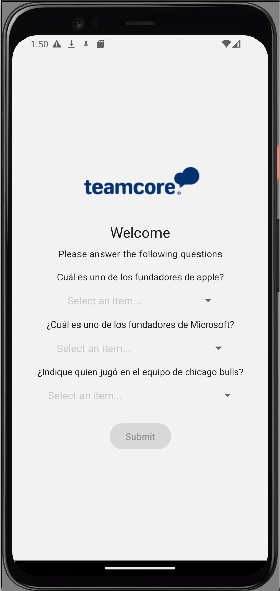

# Teamcore Mobile App


<div style="text-align:left;">
   
   
</div>

## Description

This project is part of a technical challenge to create a mobile app for Android using React Native. The app includes a user-friendly form to be filled out and submitted.

## Demo

[Expo Go App](https://expo.dev/preview/update?message=Preview&updateRuntimeVersion=1.0.0&createdAt=2024-07-17T19%3A01%3A24.857Z&slug=exp&projectId=21b82497-33ca-4031-aa10-249268dce8f8&group=065f94a7-6d36-48b1-bc8a-dfd7d1464aaf)

[APK](https://expo.dev/accounts/hackettyam/projects/teamcore-test/builds/2c2bdce5-70de-48ad-8ea0-b0655eae844d)

## App Functionalities

- Fetch and display form questions from a remote API.
- Single selection for each question.
- Submit responses in JSON format to the server.
- Navigate between form and finalization views.

## Architecture

This project uses Redux Toolkit for global state management and Axios for HTTP requests.

This codebase follows the Hexa3 architecture, which is a combination of Hexagonal Architecture and Domain-Driven Design (DDD) principles. This architecture promotes a clean separation of concerns and a modular design, making the codebase more maintainable and scalable.

### Folder Structure

```bash
├── app -> (contains routes pages)
├── domain
│   ├── constants -> (contains regex constants)
│   ├── polyfills -> (contains JS polyfills)
│   └── store -> (contains application state and actions)
├── infra
│   └── services -> (contains APIs services)
└── ui
    └── components -> (contains UI Components)
```

## Tech Stack

- [React](https://reactjs.dev/)
- [React Native](https://reactnative.dev/)
- [Expo](https://expo.dev/)
- [Redux Toolkit](https://redux-toolkit.js.org/)
- [React Native Paper](https://callstack.github.io/react-native-paper/)
- [Axios](https://axios-http.com/)
- [Typescript](https://www.typescriptlang.org/)

## Additional Resources

- API GET for questions data: [https://us-central1-teamcore-retail.cloudfunctions.net/test_mobile/api/questions](https://us-central1-teamcore-retail.cloudfunctions.net/test_mobile/api/questions)
- API POST for send answers: [https://us-central1-teamcore-retail.cloudfunctions.net/test_mobile/api/answer](https://us-central1-teamcore-retail.cloudfunctions.net/test_mobile/api/answer)

## Run the app

1. Install dependencies

   ```bash
   npm install
   ```

2. Start the app

   ```bash
    npx expo start
   ```